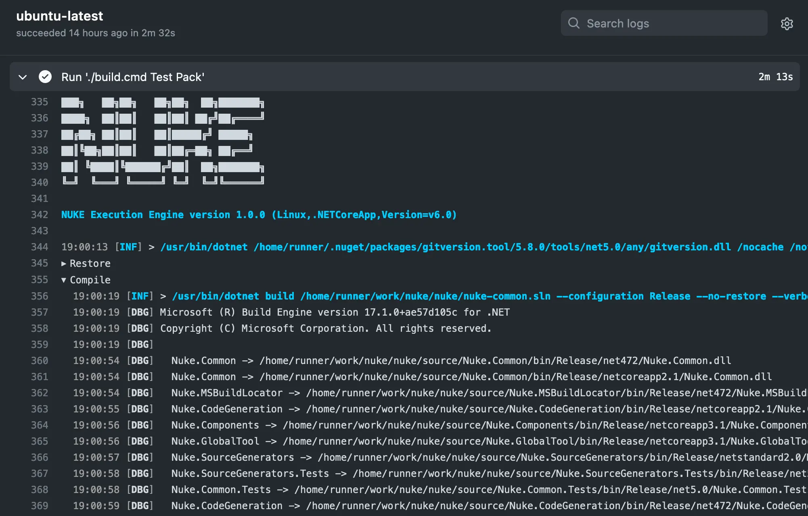

Running on [GitHub Actions](https://github.com/features/actions) will automatically enable custom theming for your build log output including [collapsible groups](https://docs.github.com/en/actions/using-workflows/workflow-commands-for-github-actions#grouping-log-lines) for better structuring:



:::info
Please refer to the official [GitHub Actions documentation](https://docs.github.com/en/actions) for questions not covered here.
:::

## Environment Variables

You can access [predefined environment variables](https://docs.github.com/en/actions/learn-github-actions/environment-variables) by using the `GitHubActions` class:

```csharp
GitHubActions GitHubActions => GitHubActions.Instance;

Target Print => _ => _
    .Executes(() =>
    {
        Log.Information("Branch = {Branch}", GitHubActions.Ref);
        Log.Information("Commit = {Commit}", GitHubActions.Sha);
    });
```

<details>
<summary>Exhaustive list of strongly-typed properties</summary>

```csharp
class GitHubActions
{
    string  Action            { get; }
    string  Actor             { get; }
    string  BaseRef           { get; }
    string  EventName         { get; }
    string  EventPath         { get; }
    JObject GitHubContext     { get; }
    JObject GitHubEvent       { get; }
    string  HeadRef           { get; }
    string  Home              { get; }
    bool    IsPullRequest     { get; }
    string  Job               { get; }
    long    JobId             { get; }
    string  PullRequestAction { get; }
    int?    PullRequestNumber { get; }
    string  Ref               { get; }
    string  Repository        { get; }
    string  RepositoryOwner   { get; }
    long    RunId             { get; }
    long    RunNumber         { get; }
    string  ServerUrl         { get; }
    string  Sha               { get; }
    string  Token             { get; }
    string  Workflow          { get; }
    string  Workspace         { get; }
}
```

</details>

## Configuration Generation

You can generate [workflow files](https://docs.github.com/en/actions/reference/workflow-syntax-for-github-actions) from your existing target definitions by adding the `GitHubActions` attribute. For instance, you can run the `Compile` target on every push with the latest Ubuntu image: 

```csharp title="Build.cs"
[GitHubActions(
    "continuous",
    GitHubActionsImage.UbuntuLatest,
    On = new[] { GitHubActionsTrigger.Push },
    InvokedTargets = new[] { nameof(Compile) })]
class Build : NukeBuild { /* ... */ }
``` 

<details>
<summary>Generated output</summary>

```yaml title=".github/workflows/continuous.yml"
name: continuous

on: [push]

jobs:
  ubuntu-latest:
    name: ubuntu-latest
    runs-on: ubuntu-latest
    steps:
      - uses: actions/checkout@v2
      - name: Run './build.cmd Compile'
        run: ./build.cmd Compile
```

</details>

:::info
Whenever you make changes to the attribute, you have to [run the build](../01-getting-started/03-execution.md) at least once to regenerate the workflow file.
:::

### Artifacts

If your targets produce artifacts, like packages or coverage reports, you can publish those directly from the target definition:

```csharp
Target Pack => _ => _
    .Produces(PackagesDirectory / "*.nupkg")
    .Executes(() => { /* Implementation */ });
```

<details>
<summary>Generated output</summary>

```yaml title=".github/workflows/continuous.yml"
- uses: actions/upload-artifact@v1
  with:
    name: packages
    path: output/packages
```
</details>

After your build has finished, those artifacts will be listed under the _Summary_ tab:

<p style={{maxWidth:'900px'}}>


</p>

### Importing Secrets

If you want to use [encrypted secrets](https://docs.github.com/en/actions/security-guides/encrypted-secrets#about-encrypted-secrets) from your organization or repository, you can use the `ImportSecrets` property to automatically load them into a [secret parameter](../02-fundamentals/06-parameters.md#secret-parameters) defined in your build:

```csharp title="Build.cs"
[GitHubActions(
    // ...
    ImportSecrets = new[] { nameof(NuGetApiKey) })]
class Build : NukeBuild
{
    [Parameter] [Secret] readonly string NuGetApiKey;
}
```

<details>
<summary>Generated output</summary>

```yaml title=".github/workflows/continuous.yml"
- name: Run './build.cmd Publish'
  run: ./build.cmd Publish
  env:
    NuGetApiKey: ${{ secrets.NUGET_API_KEY }}
```

</details>

:::note
If you're facing any issues, make sure that the name in the GitHub settings is the same as generated into the workflow file. 
:::

### Using the GitHub Token

For every workflow run, GitHub generates a [one-time token](https://docs.github.com/en/actions/security-guides/automatic-token-authentication) with [adequate permissions](https://docs.github.com/en/actions/security-guides/automatic-token-authentication#permissions-for-the-github_token) that you can use to authenticate with the GitHub API. You can enable the GitHub token in your attribute as follows:

```csharp title="Build.cs"
[GitHubActions(
    // ...
    EnableGitHubToken = true)]
class Build : NukeBuild
{
    GitHubActions GitHubActions => GitHubActions.Instance;

    Target Request => _ => _
        .Executes(() =>
        {
            Log.Information("GitHub Token = {Token}", GitHubActions.Token);
        });
}
```

<details>
<summary>Generated output</summary>

```yaml title=".github/workflows/continuous.yml"
- name: Run './build.cmd Release'
  run: ./build.cmd Publish
  env:
    GITHUB_CONTEXT: ${{ toJSON(github) }}
```

</details>

### Caching

By default, the generated workflow file will include a [caching step](https://github.com/actions/cache) to reduce the time for installing the .NET SDK (if not preinstalled) and restoring NuGet packages.

<details>
<summary>Generated output</summary>

```yaml title=".github/workflows/continuous.yml"
- name: Cache .nuke/temp, ~/.nuget/packages
  uses: actions/cache@v2
  with:
    path: |
      .nuke/temp
      ~/.nuget/packages
    key: ${{ runner.os }}-${{ hashFiles('global.json', 'source/**/*.csproj') }}
```

</details>

You can customize the caching step by overwriting the following properties:

```csharp title="Build.cs"
[GitHubActions(
    // ...
    CacheKeyFiles = new[] { "**/global.json", "**/*.csproj" },
    CacheIncludePatterns = new[] { ".nuke/temp", "~/.nuget/packages" },
    CacheExcludePatterns = new string[0])]
class Build : NukeBuild { /* ... */ }
```
